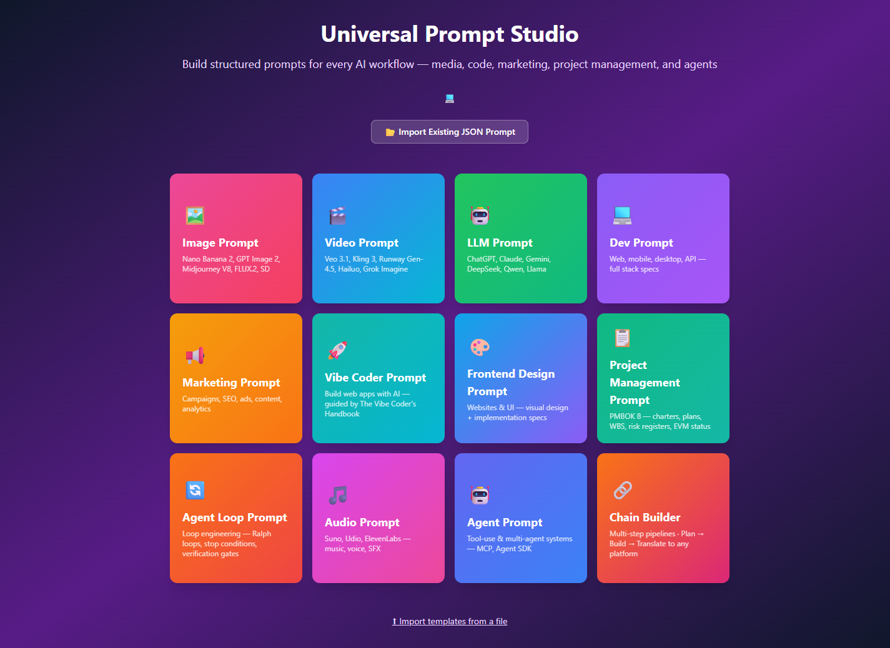
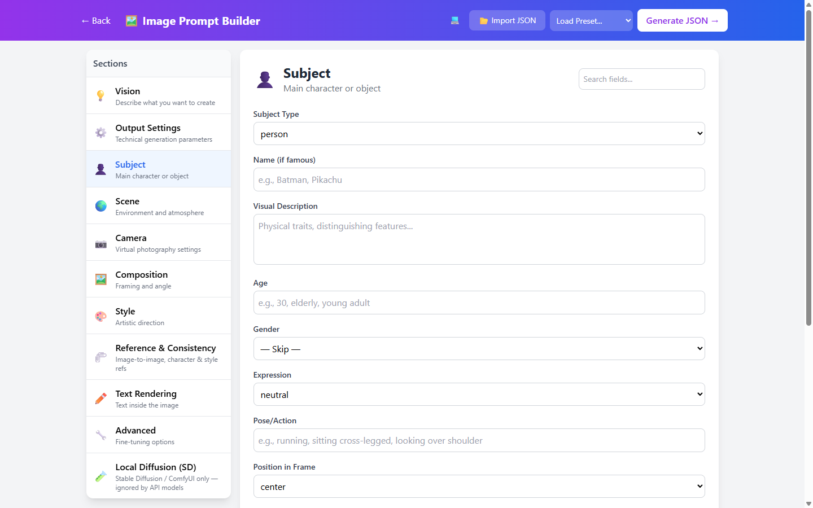
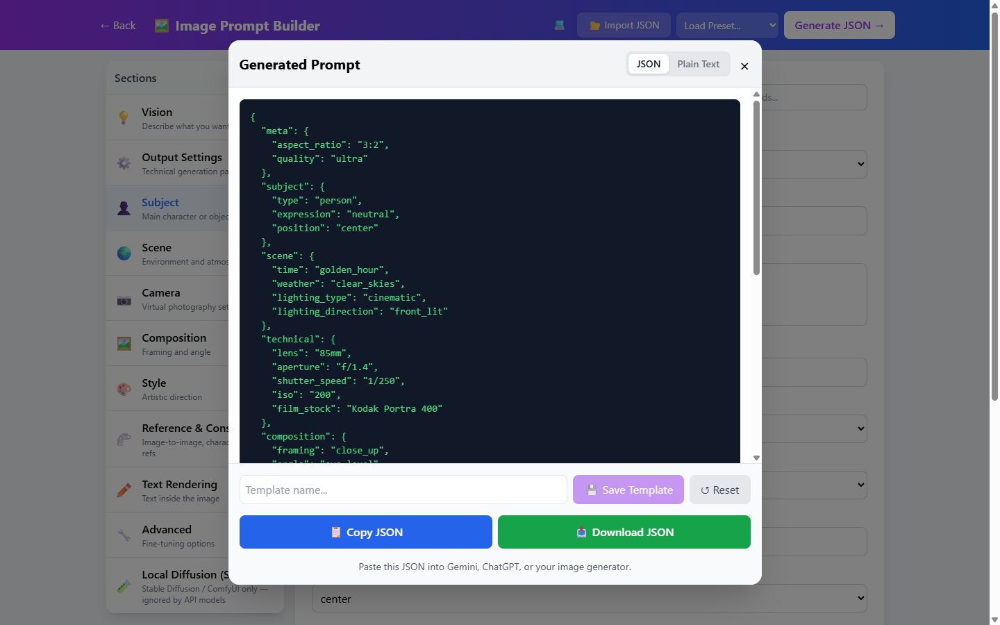
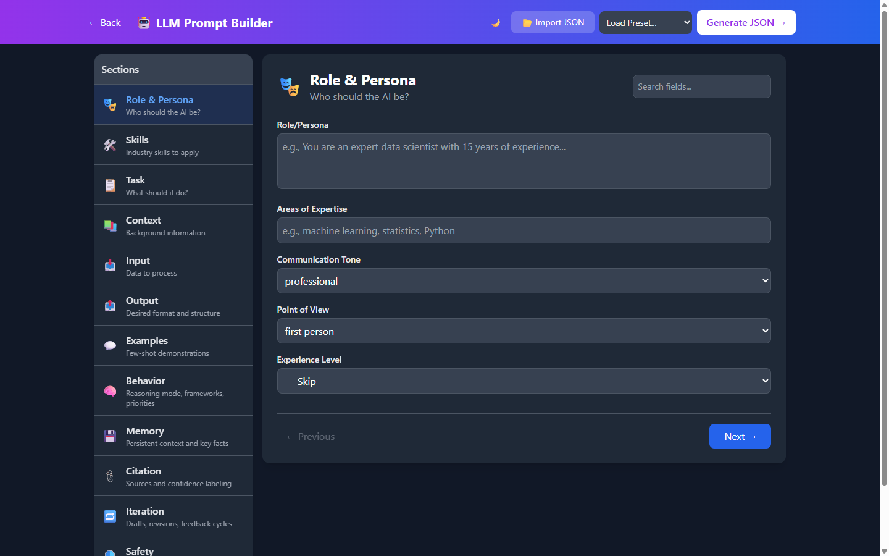
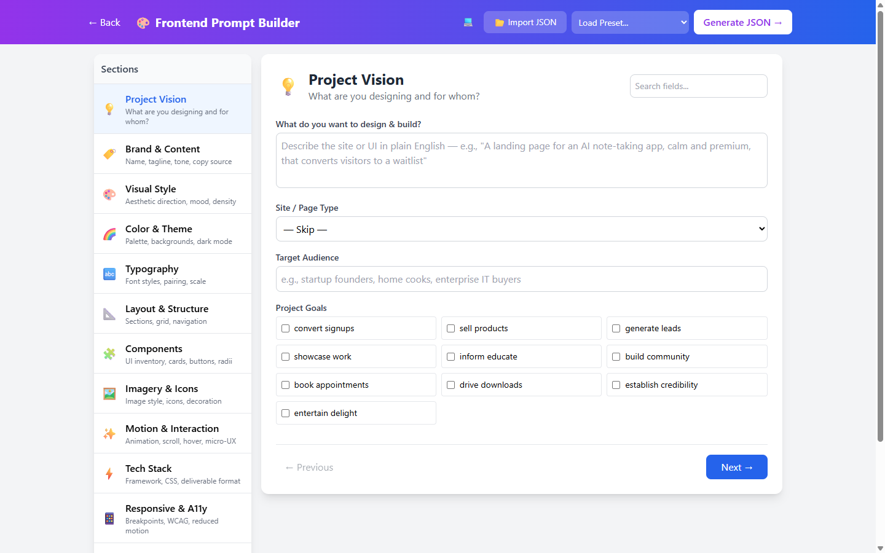
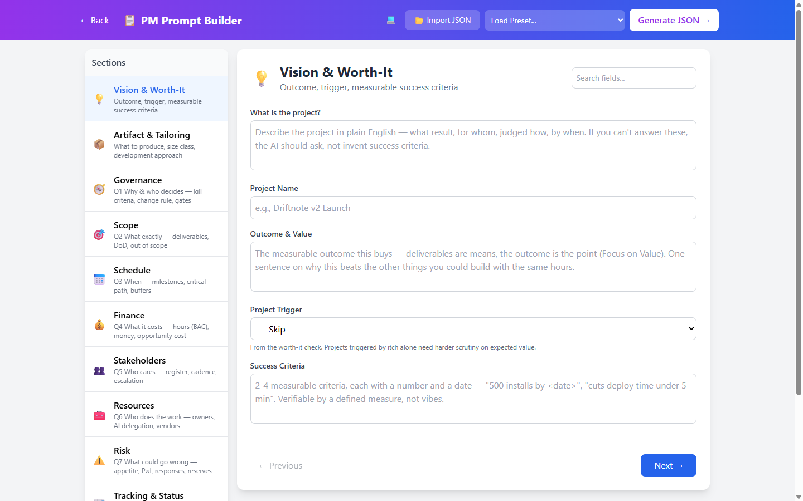
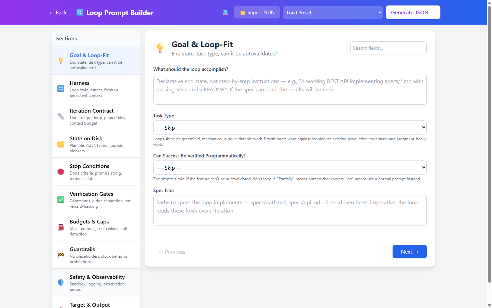
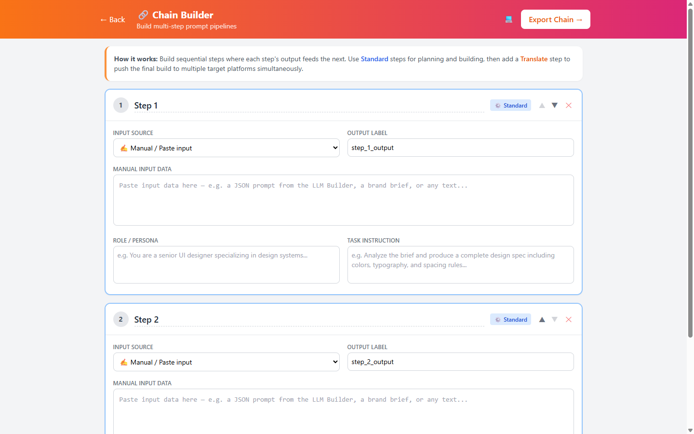

# Universal Prompt Studio

A browser-based prompt engineering studio. Twelve guided builders turn plain-English ideas into structured, model-ready prompts — for image and video generation, LLM chats, coding, marketing, frontend design, project management, agent loops, audio, and multi-agent systems.

**Zero dependencies. No build step. Just open the HTML file.**

   

  

## Quick Start

1. Download or clone this repo
2. Open `universal-prompt-studio-v11.html` in any modern browser
3. Pick a mode and start building

That's it. Everything runs client-side in your browser — no server, no account, no API keys.

## Screenshots

| | |
|---|---|
|  *Image Prompt Builder — section-by-section form* |  *Generated prompt — JSON or plain text, copy/download/save* |
|  *LLM Prompt Builder in dark mode* |  *Frontend Design Builder — visual style to tech stack* |
|  *Project Management Builder — PMBOK 8 Seven Questions* |  *Agent Loop Builder — stop conditions & verification gates* |
|  *Chain Builder — multi-step pipelines* | |

Click any thumbnail to view full size.

## The Builders

- **Image Prompt Builder** — For Nano Banana 2 / Pro (Gemini), GPT Image 2, Midjourney V8, FLUX.2, and Stable Diffusion. Covers subject, scene, camera settings, lighting, composition, style, text rendering, reference-image / character-consistency controls, plus a dedicated section for local Stable Diffusion knobs (samplers, CLIP skip, ControlNet hints).
- **Video Prompt Builder** — For Veo 3.1, Kling 3, Runway Gen-4.5, Hailuo, Grok Imagine, and LTX-2. Extends image prompts with motion, native audio, resolution, duration, and transition controls.
- **LLM Prompt Builder** — For ChatGPT, Claude, Gemini, DeepSeek, Qwen, Llama. Covers role/persona, task definition, context, output format, behavior frameworks (ROSES, CO-STAR, PTCF, etc.), memory, citation, iteration, and safety guardrails. Includes an industry skills picker with 25+ domains.
- **Dev Prompt Builder** — For code generation, debugging, refactoring, and architecture tasks. Covers language/framework selection, code context, constraints, testing requirements, and output format preferences.
- **Marketing Prompt Builder** — For ad copy, social media, email campaigns, and brand content. Covers audience targeting, tone/voice, platform constraints, CTAs, and campaign objectives.
- **Vibe Coder Prompt Builder** — Build web apps with AI, guided by The Vibe Coder's Handbook: 14 tech-stack decisions (runtime, framework, styling, database, auth, deploy) with inline guidance for each choice.
- **Frontend Design Prompt Builder** — For v0, Lovable, Bolt, Claude Code, Cursor, Figma Make, and Framer AI. Covers visual design language (30 aesthetic directions, color systems, typography), layout & structure, components, imagery, motion & interaction, frontend tech stack, responsive/accessibility targets, performance budgets, and design references. Ships with 5 presets from SaaS landing page to dark-luxury agency site.
- **Project Management Prompt Builder** — Grounded in the PMBOK Guide 8th Edition: the Seven Questions (one per performance domain), development-approach tailoring (predictive/adaptive/hybrid), project size classes, kill criteria, EVM-lite tracking (SPI/CPI/EAC), risk registers with P×I scoring, and AI-delegation planning. Generates prompts for 21 artifact types — charters, full plans, WBS/backlogs, risk registers, status reports, sprint plans, retrospectives, and plan audits.
- **Agent Loop Prompt Builder** — For "loop engineering" (the Ralph technique): running coding agents in continuous loops with fresh context per iteration. Covers loop harness styles, iteration contracts, file-based state (plan file, AGENTS.md, blockers), verifiable stop conditions, anti-reward-hacking verification gates, budgets and stall detection, and sandbox isolation. Built from July-2026 practitioner research — including the honest caveats.
- **Audio Prompt Builder** — For Suno, Udio (music), ElevenLabs / TTS (voice), and sound design. Covers genre, mood, tempo, instruments, lyrics, voice style, and production notes.
- **Agent Prompt Builder** — For tool-use and multi-agent systems (Claude Agent SDK, MCP, LangGraph). Covers objective, tool surface, reasoning loop, memory strategy, guardrails, and output.
- **Chain Builder** — Build multi-step prompt pipelines where each step's output feeds the next. Add translate steps to push to 23+ platform targets (Canva, Figma, GitHub, Vercel, n8n, etc.).

## Features

| Feature | Description |
|---------|-------------|
| Schema-driven forms | All UI generated dynamically from schema definitions |
| Presets | One-click presets per builder (Cinematic Portrait, Cyberpunk Scene, SaaS Landing Page, etc.) |
| Templates | Save, load, and manage custom templates via localStorage |
| Import / Export | JSON import/export for sharing prompts; export/import the entire template library to a file for backup |
| Field search | Filter fields by name across all sections of a builder |
| Output modes | Generate JSON or plain text output |
| Sentinel values | Any field can be set to Skip / None / Ask Me About It / Best Fit |
| Chain Builder | Multi-step sequential pipelines with output chaining |
| Medium aesthetics | 10 artistic mediums with curated aesthetic keyword sets |
| Industry skills | 25+ industry domains with top-10 skill arrays for LLM personas |
| Dark mode | Light / Dark / System theme with persistent preference |
| Toast notifications | Non-intrusive feedback for copy, save, and error events |
| Auto-save | Debounced auto-save with session recovery on next visit |

## Tech Stack

- **React 18** (CDN, pinned)
- **Tailwind CSS 3** (CDN)
- **Babel Standalone** (in-browser JSX compilation)
- **localStorage** for persistence

No npm, no webpack, no node_modules. The entire app is a single self-contained HTML file.

## Browser Support

Any modern browser — Chrome, Edge, Firefox, Safari (desktop and mobile).

## License

MIT
